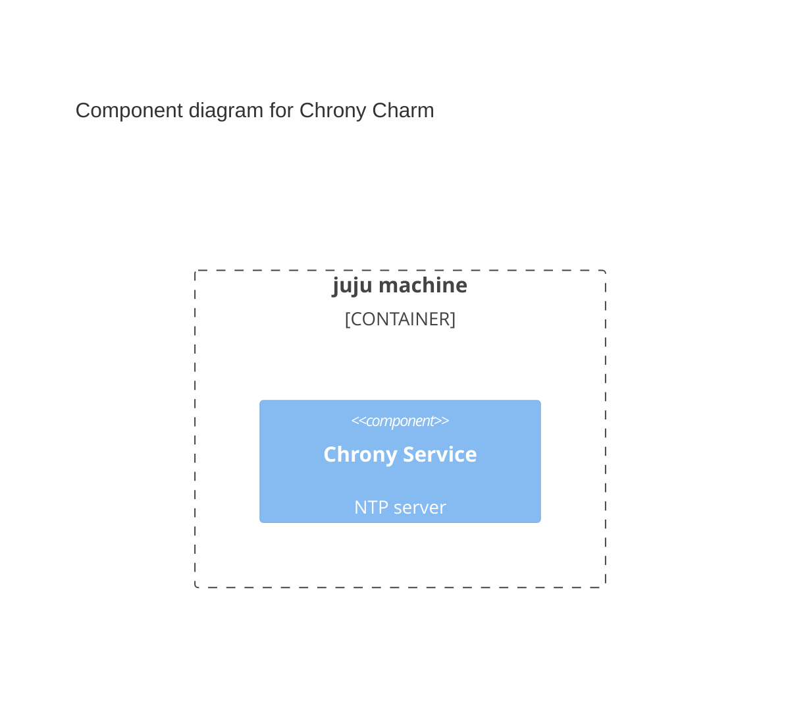

# Charm architecture

[Chrony](https://chrony-project.org/) is a Network Time Protocol (NTP) server for synchronizing system clock across systems.

The charm is a [machine charm](https://documentation.ubuntu.com/juju/latest/reference/charm/index.html#machine). Machine charms runs the software, chrony in this case, in a [juju machine](https://documentation.ubuntu.com/juju/latest/reference/machine/).
Upon deploying the charm, juju will create a base metal, virtual machine, or system container as the juju machine.
Juju will add a juju unit for the charm, which will be running the charm code to operate an instance of chrony.



Chrony is installed in the juju machine via apt. The chrony service is managed with systemd.
As a result, if you ssh into the juju machine and run `systemctl status chrony`, you should see the status of the chrony service:

```bash
● chrony.service - chrony, an NTP client/server
     Loaded: loaded (/usr/lib/systemd/system/chrony.service; enabled; preset: enabled)
     ...
```

After the charm is configured with source, e.g. `juju config chrony sources=ntp://ntp.ubuntu.com`. The charm would become active, and juju should make the `123/udp` port available.
The `123/udp` port on the juju machine is the used by the chorny service. Running `nc -vzu <IP of juju machine> 123` should result in:

```bash
Connection to <IP of juju machine> 123 port [udp/ntp] succeeded!
```

## Metrics

The charm supports metric collection with [Canonical Observability Stack (COS)](https://charmhub.io/topics/canonical-observability-stack).

Once setup the charm will provide a grafana dashboard on the COS instance with stats on chrony, such as NTP packets received, number of NTP connections, etc.

As a machine charm, the charm provides `cos-agent` integration which should be integrated with the [grafana agent subordinate charm](https://charmhub.io/grafana-agent). The grafana agent will integrate with a COS instance and transfer the dashboard setup and metrics from the chrony charm to the COS instance.

## Charm code overview

The `src/charm.py` is the default entry point for a charm and has the <relevant-charm-class> Python class which inherits
from CharmBase. CharmBase is the base class from which all charms are formed, defined
by [Ops](https://juju.is/docs/sdk/ops) (Python framework for developing charms).

> See more in the Juju docs: [Charm](https://documentation.ubuntu.com/juju/latest/user/reference/charm/)

The `__init__` method guarantees that the charm observes all events relevant to its operation and handles them.

Take, for example, when a configuration is changed by using the CLI.

1. User runs the configuration command:
```bash
juju config <relevant-charm-configuration>
```
2. A `config-changed` event is emitted.
3. In the `__init__` method is defined how to handle this event like this:
```python
self.framework.observe(self.on.config_changed, self._on_config_changed)
```
4. The method `_on_config_changed`, for its turn, will take the necessary actions such as waiting for all the relations to be ready and then configuring the containers.
